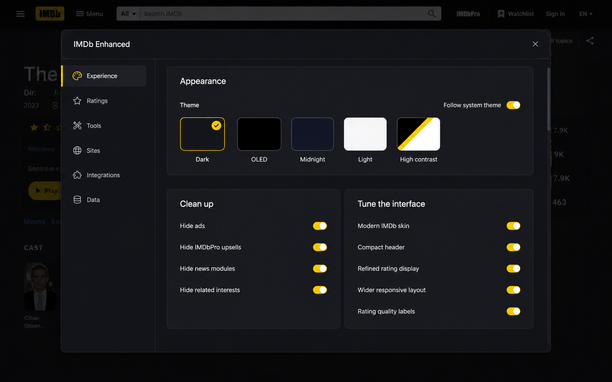

[](https://github.com/SysAdminDoc/IMDb_Enhanced)
[](LICENSE)
[](https://www.tampermonkey.net/)

# IMDb Enhanced

A desktop IMDb overhaul delivered as a single userscript and a Chromium Manifest V3 extension. Cleaner pages, modern themes, aggregated scores from Rotten Tomatoes, Letterboxd, and Metacritic, streaming site quick-search, Radarr/Sonarr integration, Plex/Jellyfin/Emby library indicators, and more.

## Features

**Page Cleanup**. Removes current IMDb ad shells, sticky placements, tracking pixels, IMDbPro upsells, news modules, app prompts, sponsored content, and contribution prompts at `document-start`. The extension build also uses Manifest V3 dynamic request rules for the known ad and measurement hosts; the userscript keeps the manager-dependent `GM_webRequest` path.

**Theme System**. Five themes (Dark, OLED, Midnight, Light, High Contrast) with a full design system: semantic colors, 3-tier elevation, 4px grid spacing, squircle avatars, hover lifts, and smooth transitions. Auto-theme follows OS preference. Rating and heatmap colours default to a scale that varies by brightness, so a red-green colour-blind reader gets the same ordering everyone else does; the traditional red-to-green scale is a setting away.

**Aggregated Scores**. Inline Rotten Tomatoes (with critics consensus on hover), Letterboxd, and Metacritic scores fetched lazily near IMDb's rating and cached locally. Lookups first resolve the exact service page through Wikidata's public IMDb-to-service identifier mapping; titles it does not cover fall back to search, where matches require an exact title and media type plus a release year within one year. If a service selects the wrong title, use Wrong? to choose from up to five candidates. You can also paste a trusted title URL or mark the source as No entry. Choices stay on the device and travel in settings backups. Cache cleanup does not remove them. Navigation aborts route-owned lookups when the manager provides an abort handle, and stale responses are discarded regardless. On a title's Ratings tab, the vote distribution IMDb publishes there is also used to compare its displayed weighted rating against the unweighted mean, which says which way the weighting leans. The same buckets say whether the votes are spread across the scale or piled at its two ends, and which end, which is the difference between a title people disagree about and one that has been rated in a campaign. Ordinary distributions get no such line. With an OMDb key stored, a Rotten Tomatoes or Metacritic lookup that comes back with nothing falls back to their API, and the widget says the score came from OMDb. Anime titles can also show the AniList community average, which is off until you turn it on and asks nothing about a title the page does not identify as anime.

**Streaming Availability**. JustWatch integration shows which streaming services carry the title, using the same lazy, route-aware lookup lifecycle and exact title/type/year identity checks on direct and search-fallback pages. Its widget has the same Wrong? correction flow when JustWatch is the selected source. A saved match follows the country selected in settings instead of keeping the country from the URL where it was first chosen.

**Editorial Title Surface**. Title pages use a stable poster-led layout with dedicated actions, score rail, synopsis, cast, and categorized research regions. The native IMDb hero remains the source of truth for live controls and data while the extension presents it in a readable, responsive hierarchy.

Third-party lookups omit destination cookies. Responses are rendered as text, outbound links suppress opener/referrer data, and response-provided URLs are restricted to the expected HTTPS service domains.

**Watch Site Search**. Quick-search buttons for streaming sites. The defaults (BBC iPlayer, Hexa, ARTE, ShuttleTV, ArrowTV, Cinezo, Movie Night, MeowTV, Chillflix, MovieBite, LatestMovies, Plex, Tubi, Fandango at Home, hoopla) use direct routes tested with both film and TV titles. Episode pages search for the parent series instead of an episode name that streaming catalogs rarely index. The full FMHY catalog remains in settings. A verified title-search route shows Add; a homepage-only entry shows Open and cannot become a broken IMDb search button. Destinations are contacted only when you open them. The userscript never probes them in the background.

**External Links**. One-click links grouped by purpose: Reviews & ratings (Rotten Tomatoes, Letterboxd, Trakt), Info & research (TMDB, Wikipedia), Trailers & video (YouTube), and Availability (JustWatch). Configurable.

**Trailer Popover**. In-page trailer dialog backed by YouTube search, with focus containment, Escape/overlay close, opener restoration, and stale-result protection. No page navigation needed.

**Radarr/Sonarr/Seerr Integration**. Quick-add and request buttons that report state: add, pending, requested, processing, or already in your library. Seerr works as a request backend, as do the Overseerr and Jellyseerr installs it was merged from in February 2026, and it resolves the IMDb ID itself, so no third-party API key is needed. Localhost-only for security.

**Media Server Indicator**. Optional Plex, Jellyfin, and Emby checks show whether the current title already exists in your local media library. Localhost-only for security; access tokens are sent in request headers, not URLs.

**Private Title Marks**. Local Seen/Skip toggle controls on title posters and on every IMDb title card (charts, lists, watchlists, person filmographies, episode lists, and search results) with exposed pressed state and a newest-first 5,000-title storage bound. Those same surfaces get an All/Unseen/Seen/Skipped filter with counts, which works entirely on the rows already loaded, makes no request, and leaves the page's own ordering alone.

**Private Notes**. A note field on title pages, up to 500 characters, saved on that device as you type and listed with your marks. A note can exist without marking the title, marking or unmarking never disturbs it, and notes travel in backups. They are excluded from the diagnostics report on purpose. They require no login and deliberately do not change or sync IMDb's account-based Watched status.

**Viewing History Import.** Paste or upload an IMDb or Letterboxd CSV, inspect a count before writing anything, then merge its ratings and viewing dates into local Seen marks. Headers are matched by name, including IMDb's newer Original Title column. Rows with Const or imdbID map directly; Title and Year can match a title already stored on that device. Invalid or unresolved rows are counted and skipped. A title keeps its 100 newest distinct viewing events, and the preview reports any older event that won't be retained. This local import never changes IMDb Watched status or an IMDb list.

**Local Personal Stats.** The Data page turns private marks and imported viewing history into local counts, activity by year, top genres, release decades, personal rating comparisons, and known runtime. Fresh installs get a clear empty state. A year review appears after 10 dated viewings in one year, and missing metadata stays missing instead of being guessed. The calculations never leave the device.

**Parents Guide Severities**. Optional. Clicking the Parents Guide link on a title page expands the five severity ratings in place instead of loading the page, each linking through to its own section. Nothing is requested until you click, and the guide is read from IMDb itself. A verification challenge is reported as a refusal, not an outage.

**TV Tools**. Highest-rated episode highlighting and TV-specific lookup shortcuts. Synopsis blur is opt-in and off by default.

**List Page Tools**. Batch IMDb ID copy plus a popup-safe search queue on watchlist, custom list, and chart pages, including IMDb's locale-prefixed desktop URLs. Prepare up to 20 real new-tab links, open them one gesture at a time, or copy the full link set. A runtime summary totals how long the listed titles would take to watch, recounts as more rows load, and names how many rows had no runtime listed rather than reporting a smaller total as if it were complete. A Copy as CSV button writes the loaded rows using IMDb's own column names, so the file reads back into IMDb and into other tools, and says how many rows carried no rating.

**Extras**. Collapsible sections with remembered state, optional keyboard-revealable spoiler blur, a keyboard-complete expanded-links menu, quick navigation sidebar, wider layout, compact header, subtitle links, copy IMDb ID button, and settings import/export.

## Userscript install

1. On a desktop browser, install [Tampermonkey](https://www.tampermonkey.net/), [Violentmonkey](https://violentmonkey.github.io/), or [ScriptCat](https://github.com/scriptscat/scriptcat).
2. **On Chrome, Edge, Brave, and other Chromium browsers, turn on user scripts first**. See the next section. Firefox needs no extra step.
3. [Click here to install the userscript](https://raw.githubusercontent.com/SysAdminDoc/IMDb_Enhanced/main/IMDb_Enhanced.user.js).
4. Visit any IMDb title page. Open settings with the gear icon.

Updates are delivered automatically via the `@updateURL` metadata.

### Chromium: enable user scripts

Manifest V3 removed the old permissions that userscript managers relied on, so
Chromium browsers now require one manual switch before any userscript runs. The
manager itself must also be a Manifest V3 build: Tampermonkey 5.6 or newer,
Violentmonkey 2.48.0 or newer, or ScriptCat 1.4 or newer. Violentmonkey below
2.48.0 can take minutes to install a script on Chrome 146 and later, which its
release notes trace to leftover webRequest registrations.

- **Chrome 138 and newer:** open `chrome://extensions`, click **Details** on your
  userscript manager, and turn on **Allow User Scripts**.
- **Chrome 137 and older:** open `chrome://extensions` and turn on **Developer
  mode** in the top-right corner.
- **Then reload any IMDb tabs you already had open.** Scripts do not start in
  tabs that loaded before the switch was flipped.

Tampermonkey may show a "Developer mode required" banner on Chrome 138+ even when
Developer mode is already on. The message is out of date. The **Allow User
Scripts** toggle described above is the setting it actually needs.

If you would rather not manage that switch, install the Chromium extension below
instead; it needs none of these steps.

## Chromium extension

The extension build is generated locally from the same userscript source and adds proper extension storage, privileged cross-origin lookups, and stronger request blocking.

1. Install Node.js 22 or newer.
2. From the repository root, run `npm run build:extension`.
3. Open `chrome://extensions`, enable **Developer mode**, choose **Load unpacked**, and select the repository's `extension` folder.
4. Open or refresh an IMDb page. After source changes, run the build command again and use the extension card's reload button before refreshing IMDb.

Installing asks for access to IMDb and nothing else. Every other site the extension can reach (the score services, JustWatch, YouTube, Wikidata, the known ad hosts, and localhost for media servers) is optional, requested in the smallest group a feature needs, and released when you switch that feature off. Turning off one score source keeps the shared lookup service the other two still use.

Granting happens on the extension's own page, because that is the only place a browser lets an extension ask. Open it from the toolbar button, or from the Grant access button that appears beside any setting whose sites are not yet allowed. The IMDb panel only says the page opened after the browser confirms it. Each setting shows which sites it uses and whether access is currently granted, so a feature that is on but cannot reach its service says so rather than silently failing. The background worker checks the current grant again before every optional request, including services whose own CORS policy would otherwise allow the connection.

Click the toolbar button to open the settings recovery page. It runs on the extension's own origin rather than inside an IMDb page, so backup, restore, reset with undo, diagnostics, and the list of granted hosts stay reachable even when site access is revoked or IMDb changes its markup. Userscript installs get the same actions from the manager's extension menu.

The extension does not auto-update from GitHub; reload the unpacked build after local changes.

## Firefox extension

Firefox implements Manifest V3 with event pages instead of service workers and
asks you to approve site access after installing, so it gets its own generated
build. Firefox 142 or newer is required.

1. Run `npm run build:firefox` to generate the `extension-firefox` folder.
2. Open `about:debugging#/runtime/this-firefox`, choose **Load Temporary
   Add-on**, and select `extension-firefox/manifest.json`.
3. Click the IMDb Enhanced toolbar button and choose **Grant site access**.
   Firefox withholds host permissions until you approve them, so the extension
   stays inactive until this step is done.
4. Reload any IMDb tabs that were already open.

Temporary add-ons are removed when Firefox restarts. The build passes
`npx web-ext@10.6.0 lint` with no errors. It declares the page content an
enabled score or availability lookup sends to a third party, and nothing else.
The linter is pinned because its rules change between releases, so an unpinned
run says nothing repeatable.

The userscript remains the better option on Firefox for permanent installs,
since Mozilla continues to support the Manifest V2 userscript managers.

## Configuration

Click the gear icon on any covered IMDb page to open the six-section settings workspace. A search box at the top matches every feature by name, description, or keyword across all six pages, so you can find a setting without knowing which page owns it. Changes save automatically with visible feedback, the vertical navigation supports arrow/Home/End keys, and the dialog traps focus until it is closed.



The redesigned visual reference set covers every menu page: [Experience](design/mockups/14-redesign-experience-1536x1024.png), [Ratings](design/mockups/15-redesign-ratings-1536x1024.png), [Tools](design/mockups/16-redesign-tools-1536x1024.png), [Sites](design/mockups/17-redesign-sites-1536x1024.png), [Integrations](design/mockups/18-redesign-integrations-1536x1024.png), and [Data](design/mockups/built-data-1440x900.png).

**Experience**. Theme, cleanup, appearance, and layout controls. Theme choices include a system-following mode.

**Ratings**. Aggregated-score, rating-comparison, episode-heatmap, and streaming-availability controls with an inline preview.

**Tools**. Title, TV/episode, list, private Seen/Skip, and optional keyboard-shortcut controls.

**Sites**. Editable watch-search and external-link destinations with show/hide controls, purpose categories, ordering, and colors. Page buttons are grouped into Watch, Reviews & ratings, Availability, Trailers & video, Info & research, and Other. Incomplete, non-HTTP(S), credential-bearing, origin-dynamic, or unknown-token templates are visibly rejected without replacing the last valid saved list.

**Integrations**. Tabbed Radarr/Sonarr and Plex/Jellyfin/Emby local-service configuration with arrow/Home/End keyboard navigation, plus an optional library-status badge on list, chart, and filmography rows.

**Data.** Local viewing stats, private mark review, IMDb and Letterboxd CSV history import, validated JSON backup/restore with optional passphrase-encrypted credential export, cache status/clearing, a persistent failure journal, and an explicit two-step reset with backup guidance. Removing a mark, or clearing the lot, can be undone from the panel for fifteen seconds afterwards, and the undo brings back the notes and viewing dates too.

**Failure journal**. The last 20 feature failures, kept across reloads so intermittent breakage is visible. Entries record the time, the feature, the kind of page, and a failure category. HTTP responses are kept separate from connection failures, and only server errors qualify for a bounded stale score. Entries never record the error text, so a title, a lookup address, or a token echoed back by a local service cannot end up in one. Copy it into a bug report or clear it from the same card.

**Watch Sites**. Add, remove, reorder, show/hide, categorize, and customize streaming site buttons with name, URL template, and color. The FMHY streaming catalog sits under the editor as a filterable list grouped by the wiki's own sections. Sites with a tested contextual search route can be added as normal editable rows. Homepage-only entries open for browsing but are not added to IMDb pages. Entries already in your list read as Added. A list holds up to 250 destinations.

**External Links**. Same customization as watch sites for review, availability, trailer, and research links; hidden destinations remain available to re-enable later. A Stremio entry ships hidden and opens the title in the Stremio app. It is the only non-HTTP(S) destination allowed, matched as one exact built-in template rather than by scheme, so any other `stremio://` URL is refused.

**Radarr/Sonarr/Seerr**. URL, API key, root folder, and quality profile for Radarr and Sonarr; URL and API key for a Seerr instance, or an Overseerr or Jellyseerr one. Localhost/127.0.0.1 only. Current Sonarr v4+ language selection belongs in quality-profile custom formats; retired v3 language profiles are not configured.

**Updates** (extension only). Off switch for the once-a-day check that reads the published version number and tells you when a newer build exists. Turning it off stops the request.

**Media Servers**. Plex URL/token and Jellyfin/Emby URL/API key fields for local library checks. Localhost/127.0.0.1 only. Jellyfin is asked for its library over the `MediaBrowser` authorization scheme, which is what Jellyfin 12 reads; servers running 10.x accept it too. Emby keeps the older token header it still uses.

**Streaming availability source**. JustWatch (read from their page) or TMDB (their documented API, with a read token of your own from themoviedb.org). Both sources use the two-letter country set below the source selector. TMDB resolves the title from its IMDb id rather than by matching titles and displays the credit both TMDB and JustWatch require. Pick TMDB without a token and the panel says so rather than falling back to reading a page. The widget opens the validated title page returned by whichever source produced the result, so a TMDB result keeps its regional TMDB watch page even when that country has no offers. Cached answers are separated by source and country, which keeps a source or region change from showing the previous choice.

**Desktop from mobile links**. On by default, under Tools as Mobile links. A link copied from a phone points at IMDb's mobile site, which this does not run on. Opening one on a computer sends you to the same page on the normal site. It leaves phones alone, and you can switch it off there.

**Export your marks**. The Data page copies your marks as CSV in two shapes: everything stored, with the columns Const, State, Timestamp, Title and Note, and a Letterboxd-importable one with imdbID and WatchedDate. The Letterboxd shape covers Seen titles only, one row per logged viewing, so a rewatch imports as a rewatch.

**Watchlist alerts** (extension only). Off by default. Once a day the extension checks part of your watchlist against TMDB and tells you, in one notification, when something has turned up on a service you picked. It needs a TMDB read token and the notification permission, which you allow from the extension own page. The watchlist it checks is the page you last opened, up to 200 titles, and it works through them a slice at a time rather than all at once.

**MDBList API key**. Optional, and the only way to get a Letterboxd score in the web-store build, since Letterboxd publishes no API of its own. One MDBList call answers Rotten Tomatoes, Metacritic and Letterboxd together, and it's asked after OMDb, so an install that already has an OMDb key keeps the answers it was getting. Keys are free from mdblist.com. Each score says when it came from MDBList.

**OMDb API key**. Optional. Rotten Tomatoes and Metacritic scores normally come from reading each site's own page. Store an OMDb key here and a lookup that fails falls back to their API instead, labelled so you can tell which answer you are looking at. Keys are free for a thousand lookups a day from omdbapi.com. In the web-store build, which ships no page readers, this is where those two scores come from in the first place.

**URL Templates**. Use `{{TITLE}}`, `{{TITLE_DASH}}`, `{{TITLE_SLUG}}`, `{{IMDB_ID}}`, `{{IMDB_NUM}}`, `{{TRAKT_TYPE}}`, `{{YEAR}}` in custom site URLs.

**Import/Export.** JSON backup and validated, transactional restore, including remembered section state. The size a restore accepts is worked out from the storage limits, so a backup this build wrote always reads back. The Data page also accepts IMDb and Letterboxd CSV history exports. Both import paths validate and preview before writing; a storage failure restores the prior values before reporting the error.

Integration API keys and tokens are left out of an ordinary backup, which names what it omitted, and restoring one keeps whatever credentials that device already has. **Export with credentials** is the separate action that includes them: it asks for a passphrase, derives a key with PBKDF2-SHA256 at 600,000 iterations, and encrypts the backup with AES-GCM under a fresh salt and nonce. Importing one asks for the passphrase as soon as it recognizes the file. A wrong passphrase or a modified file is refused before anything is written, and nothing can recover the contents if you lose the passphrase.

## Themes

| Dark (default) | OLED | Midnight | Light | High Contrast |
|---|---|---|---|---|
| Deep charcoal surfaces | True black backgrounds | Navy blue tones | Clean white | Maximum-contrast black and yellow |

## Privacy and trust

- **No telemetry, ever.** Nothing is transmitted to any IMDb Enhanced service, because there isn't one. There are no analytics, no error reporting, no accounts, and no remote configuration. Settings → Data can copy a diagnostics report for a bug report, and that report only reaches your clipboard.
- **No runtime dependencies.** The userscript is one file with zero third-party libraries, and the extension builds are generated without bundling a dependency. The development test suite uses happy-dom after `npm ci`, but nothing is fetched at install or at runtime to make the project work.
- **No remote code.** Everything that executes ships in the file you installed. Nothing is `eval`'d and no script is loaded from a CDN, which is also what keeps the extension builds compliant with Chrome Web Store and AMO policy.
- **Unminified and readable.** The shipped userscript is the source. You can read every line of what you are running.
- **Local-only storage.** Preferences, private Seen/Skip marks, and cached lookups live in your userscript manager or `chrome.storage.local`. Integration credentials for Radarr, Sonarr, Seerr, Plex, Jellyfin, and Emby are restricted to `localhost`/`127.0.0.1` and are sent only to those services, as request headers rather than in URLs. In the extension builds those keys stay in the background worker and are never handed to the IMDb tab. A request names the key it needs, and the worker attaches it only after checking the destination is a local address and the name is one of the six it recognizes. Which header carries it is the worker's decision as well, so a page that can't read a key can't move one into another service's authentication scheme either. Nothing running in the page can read a stored key, which is why the settings field shows a saved key as configured instead of displaying it.
- **What does leave your browser:** anonymous, cookie-free lookups to Rotten Tomatoes, Metacritic, Letterboxd, JustWatch, YouTube, AniList, and Wikidata, made only for the title you are looking at and only for the score sources you have enabled. Two more are contacted only if you store a key for them: TMDB, if you pick it as the availability source, and OMDb, if you save a key for the score fallback. Those two receive the IMDb id rather than the title text. Each one is cached locally so a repeat visit makes no request at all. Turn a source off and it is never contacted.
- **One request that isn't a lookup.** The extension builds can't update themselves, so once a day the background worker reads the published userscript's version line from `raw.githubusercontent.com` and the panel says when a newer one exists. It's a plain GET of a public file. Nothing about you or the page you're on goes with it, and turning off the update notice in Settings stops it. The userscript build never does this; its manager handles updates.

### Where the source lives

The source is the set of modules in `src/`, one per area: the metadata block, bootstrap and configuration, storage, the CSV mark importer, DOM helpers, encrypted backup, page data, the toast, the request layer, the feature registry, the design system, the feature groups, the injected stylesheet, the settings UI, and the router.

`IMDb_Enhanced.user.js` is built from them and committed, because that is the file a script manager installs and the file Greasy Fork reads. The build is a byte concatenation in filename order, so nothing is minified, rewritten, or bundled on the way through: the file you install is the modules, in order, unchanged.

```bash
npm run build:userscript       # rebuild IMDb_Enhanced.user.js from src/
npm run check:userscript       # fail if the committed file has drifted from src/
```

The two-digit prefix on each filename is its position in the output. `npm test` runs the check first, so an edit made to a module but never assembled, and an edit made straight to the generated userscript, both fail the suite rather than surviving in the tree.

### Verifying a build

Every build is generated deterministically from the modules, so you can confirm that a build matches the source:

```bash
git checkout <commit>
npm run build:extension        # reassembles the userscript, then regenerates extension/
git status --short             # no output means the shipped build matches that commit
```

`IMDb_Enhanced.user.js`, `extension/content.js`, `extension/boot.css`, and `extension/manifest.json` are committed, so any difference between what ships and a rebuild from the same commit shows up as a diff.

Install the development dependency once with `npm ci`, then run `npm test` to exercise the source checks, the offline IMDb DOM fixtures, both extension builds, the background worker, and both GM API implementations. `npm run test:dom` runs only the fixture suite. It covers title, ratings, episodes, person, and chart pages without contacting IMDb. A failed selector check names the selector and saves the DOM under `tests/artifacts/dom-fixtures/` for inspection.

`npm run capture:fixtures` refreshes those snapshots from IMDb through a persistent browser profile. IMDb may serve a Human Verification page to an automated session, so capture is a developer maintenance command and never a required test gate. The committed sanitized snapshots keep the regular suite deterministic and offline.

Every string a person reads lives in `MESSAGES` near the top of `IMDb_Enhanced.user.js`, and the code asks for it by key through `t()` (or `tCount()` when a count changes the wording). The build writes that catalog out as `_locales/en/messages.json` in each extension package, plus an `en_XA` pseudo-locale whose entries are bracketed, so loading the extension under it shows at a glance which words still come from the source. The test suite fails on a sentence or a label written at the call site, on a count-dependent message built with a ternary, and on a key that nothing asks for. Service names and IMDb's own control text are deliberately left alone, and the list of those exclusions is in the suite with a reason beside each one.

`npm run pack` rebuilds every profile and writes four archives plus their SHA-256 sums to `dist/`: the Chromium package from `extension/`, the Firefox one from `extension-firefox/`, the web-store one from `extension-store/`, and a source archive for AMO, which requires the source of any add-on it cannot read. The zip writer is part of the repository rather than a dependency, so the archives are deterministic: entries are sorted and written with a fixed timestamp, and two builds of the same commit produce identical bytes and identical checksums.

To rebuild an archive and check it against a published one: `npm ci`, then `npm test` (which regenerates every build directory and fails if any of them disagrees with the source), then `npm run pack`, and compare `dist/SHA256SUMS-<version>.txt`. Node 22 or newer, and nothing else. Those are also the instructions AMO asks for with a source submission.

AMO reviewers rebuilding the Firefox add-on on its own can run `npm ci` and then `npm run build-for-amo`, which writes `extension-firefox/` and nothing else. The `packageManager` field names the npm version the committed lockfile was written with, so `npm ci` resolves the same tree it did here.

`npm run build:store` produces a third build, in `extension-store/`, for a web-store listing. It ships no default watch destinations and no catalog of them, and it does not request access for any service whose answers come from parsing that service's pages. Rotten Tomatoes and Metacritic scores come from the OMDb API there instead, with a key of your own. Letterboxd has no API, so that score comes from MDBList with a key of your own, which is the only route to one in a build that reads no pages. Streaming availability there comes from TMDB's API with a token of your own. It is generated from the same source by the same script, so the only differences are the ones listed here. It carries its own listing description, and `npm test` builds the directory and compares it against the generator, so a stale one fails the suite.

Every outside service the extension can reach is declared in one place, the `PROVIDERS` map near the top of `IMDb_Enhanced.user.js`. Each entry names the service, the origins it needs, what leaves your browser to reach it, how long its answers are cached, and the credit it requires. The origins in both manifests are generated from that map, so the permissions a build asks for cannot drift from the list you can read. The build refuses to run if an entry is incomplete, or if a manifest ends up asking for an origin no service accounts for.

Every version this repository contains has a tag, so the rebuild check above works on any of them rather than only the newest. The five entries above 2.4.0 in the changelog predate the repository and have no commit to check out. Older tags predate some of the build commands named here, so run the ones that tag's own package.json declares. Release archives with checksummed Chromium, Firefox, web-store, and source builds are attached to the recent entries on the [GitHub Releases page](https://github.com/SysAdminDoc/IMDb_Enhanced/releases); older tags are there to check out and rebuild rather than to download. The userscript at the install link above remains the direct install for script managers.

## Compatibility

- Desktop `www.imdb.com` title, person, list/watchlist, chart, and episode-list routes, including localized desktop paths.
- Desktop Tampermonkey, Violentmonkey and ScriptCat, at the versions named under Userscript install. Mobile IMDb domains are intentionally outside the match scope.
- Chromium Manifest V3 extension builds use the background service worker for cross-origin requests and dynamic ad rules; userscript request cancellation remains manager-dependent. Visual ad cleanup remains active when `GM_webRequest` is unavailable.

## License

[MIT](LICENSE)
