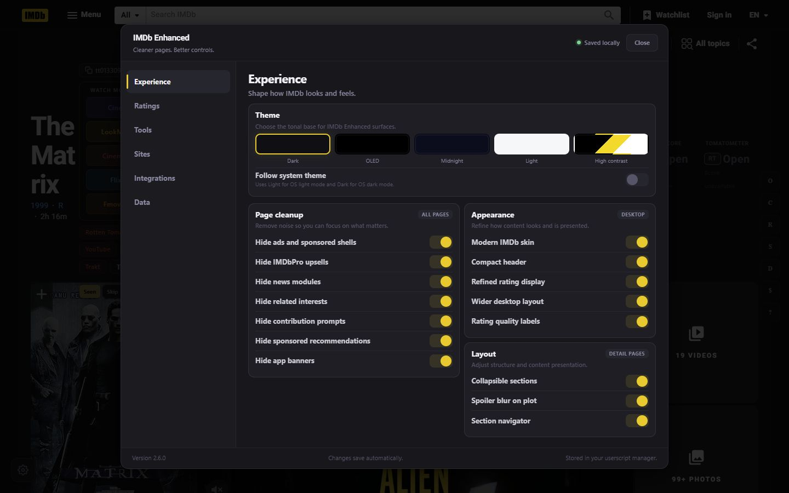

# IMDb Enhanced

A desktop IMDb overhaul delivered as a single userscript. Cleaner pages, modern themes, aggregated scores from Rotten Tomatoes, Letterboxd, and Metacritic, streaming site quick-search, Radarr/Sonarr integration, Plex/Jellyfin/Emby library indicators, and more.

## Features

**Page Cleanup** - Removes current IMDb ad shells, sticky placements, tracking pixels, IMDbPro upsells, news modules, app prompts, sponsored content, and contribution prompts at `document-start`. Known ad and measurement requests are also cancelled when the userscript manager exposes `GM_webRequest`; Chromium Tampermonkey 5.2+ does not expose that API, so a userscript cannot guarantee network-level blocking there.

**Theme System** - Five themes (Dark, OLED, Midnight, Light, High Contrast) with a full design system: semantic colors, 3-tier elevation, 4px grid spacing, squircle avatars, hover lifts, and smooth transitions. Auto-theme follows OS preference.

**Aggregated Scores** - Inline Rotten Tomatoes (with critics consensus on hover), Letterboxd, and Metacritic scores fetched lazily near IMDb's rating and cached locally. Navigation aborts route-owned lookups when the manager provides an abort handle, and stale responses are discarded regardless. Rating histogram shows 1-10 vote distribution at a glance.

**Streaming Availability** - JustWatch integration shows which streaming services carry the title, using the same lazy, route-aware lookup lifecycle.

Third-party lookup responses are rendered as text and their outbound links are restricted to the expected HTTPS service domains.

**Watch Site Search** - Quick-search buttons for streaming sites (StreamXTV, LookMovie, CineVids, CinemaOS, LivNet, Flixer, Cine.su, Fmovies+, Cineby). Fully configurable in settings. Destinations are contacted only when you open them; the userscript does not background-probe every site.

**External Links** - One-click links to Rotten Tomatoes, Letterboxd, TMDB, YouTube trailers, Wikipedia, JustWatch, and Trakt. Configurable.

**Trailer Popover** - In-page trailer modal backed by YouTube search. No page navigation needed.

**Radarr/Sonarr Integration** - Quick-add buttons with library status indicator (green dot when a title is already in your library). Localhost-only for security.

**Media Server Indicator** - Optional Plex, Jellyfin, and Emby checks show whether the current title already exists in your local media library. Localhost-only for security.

**Watched Marking** - Local watched/skip marks on title posters and recommendation cards. No IMDb login required.

**TV Tools** - Episode synopsis blur, highest-rated episode highlighting, TV-specific lookup shortcuts.

**List Page Tools** - Batch IMDb ID copy plus a popup-safe search queue on watchlist, custom list, and chart pages. Prepare up to 20 real new-tab links, open them one gesture at a time, or copy the full link set (a title list for Cineby's local handoff).

**Extras** - Collapsible sections with remembered state, spoiler blur, quick navigation sidebar, wider layout, compact header, subtitle links, copy IMDb ID button, settings import/export.

## Install

1. On a desktop browser, install [Tampermonkey](https://www.tampermonkey.net/) or [Violentmonkey](https://violentmonkey.github.io/).
2. [Click here to install the userscript](https://raw.githubusercontent.com/SysAdminDoc/IMDb_Enhanced/main/IMDb_Enhanced.user.js).
3. Visit any IMDb title page. Open settings with the gear icon.

Updates are delivered automatically via the `@updateURL` metadata.

## Configuration

Click the gear icon on any covered IMDb page to open the six-section settings workspace. Changes save automatically with visible feedback, the vertical navigation supports arrow/Home/End keys, and the dialog traps focus until it is closed.

**Experience** - Theme, cleanup, appearance, and layout controls. Theme choices include a system-following mode.

**Ratings** - Aggregated-score, histogram, and streaming-availability controls with an inline preview.

**Tools** - Title, TV/episode, list, watched-mark, and keyboard-shortcut controls.

**Sites** - Editable watch-search and external-link destinations, URL templates, ordering, colors, and Cineby handoff. Incomplete, non-HTTP(S), or credential-bearing URLs are visibly rejected without replacing the last valid saved list.

**Integrations** - Tabbed Radarr/Sonarr and Plex/Jellyfin/Emby local-service configuration with arrow/Home/End keyboard navigation.

**Data** - Local mark review, import validation, export, cache status, clearing, and reset/recovery actions.

**Watch Sites** - Add, remove, reorder, and customize streaming site buttons with name, URL template, and color.

**External Links** - Same customization as watch sites for research/trailer links.

**Cineby** - Preferred Cineby host selector with a one-time, ten-minute local search handoff that is consumed as soon as Cineby opens.

**Radarr/Sonarr** - URL, API key, root folder, and quality profile for each. Localhost/127.0.0.1 only.

**Media Servers** - Plex URL/token and Jellyfin/Emby URL/API key fields for local library checks. Localhost/127.0.0.1 only.

**URL Templates** - Use `{{TITLE}}`, `{{TITLE_DASH}}`, `{{TITLE_SLUG}}`, `{{IMDB_ID}}`, `{{IMDB_NUM}}`, `{{TRAKT_TYPE}}`, `{{YEAR}}` in custom site URLs.

**Import/Export** - Full JSON backup and validated, transactional restore. Invalid or unknown fields are skipped; a storage failure restores the prior values before reporting the error.

## Themes

| Dark (default) | OLED | Midnight | Light | High Contrast |
|---|---|---|---|---|
| Deep charcoal surfaces | True black backgrounds | Navy blue tones | Clean white | Maximum-contrast black and yellow |

## Compatibility

- Desktop `www.imdb.com` title, person, list/watchlist, chart, and episode-list routes, including localized desktop paths.
- Desktop Tampermonkey and Violentmonkey. Mobile IMDb domains are intentionally outside the match scope.
- Full request cancellation is manager-dependent. Visual ad cleanup remains active when `GM_webRequest` is unavailable.

## License

[MIT](LICENSE)
